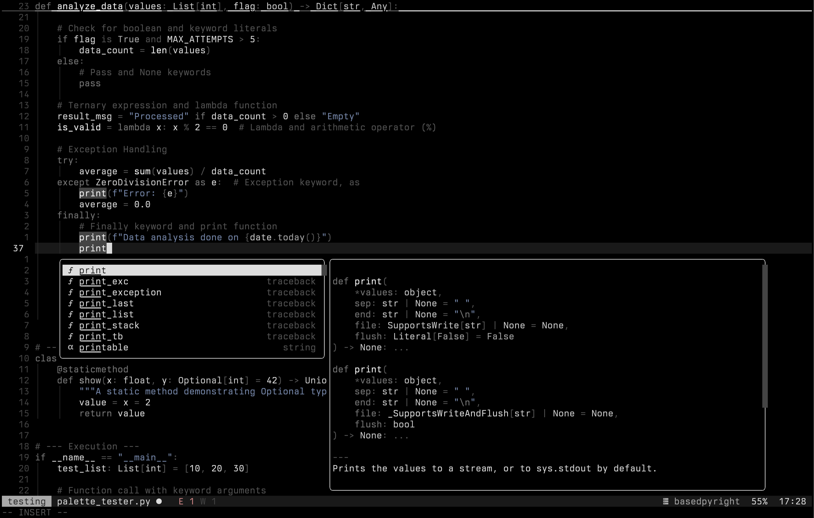

<p align="center">
    <h2 align="center">misirlou.nvim for Neovim</h2>
</p>

<p align="center">A dark, elegant Neovim colorscheme with midnight tones</p>

## Preview



## About

misirlou.nvim is a dark Neovim colorscheme featuring deep midnight tones and carefully balanced contrast. Built on the foundations of [rose-pine/neovim](https://github.com/rose-pine/neovim), it reimagines the color palette with darker backgrounds and sophisticated accent colors while maintaining the thoughtful structure and extensive plugin support of its inspiration.

## Credits

This theme builds upon the excellent work of the [Rosé Pine](https://github.com/rose-pine/neovim) project. The core architecture, highlight group definitions, and plugin integrations are derived from rose-pine/neovim. misirlou.nvim adapts these foundations with its own unique color palette and aesthetic direction.

## Getting Started

### Installation

Install `misirlou.nvim` using your favorite package manager:

#### [lazy.nvim](https://lazy.folke.io/installation)

**Structured Setup**

```lua
return {
    "pompos02/misirlou.nvim",
    name = "misirlou",
    config = function()
        vim.cmd("colorscheme misirlou")
    end
}
```

**Single file**

```lua
{ "pompos02/misirlou.nvim", name = "misirlou" }
```

#### [packer.nvim](https://github.com/wbthomason/packer.nvim)

```lua
use { "pompos02/misirlou.nvim", as = "misirlou" }
```

#### [vim-plug](https://github.com/junegunn/vim-plug)

```vim
Plug 'pompos02/misirlou.nvim', { 'as': 'misirlou' }
```

## Configuration

> [!IMPORTANT]
> Configure options _before_ setting colorscheme.

misirlou.nvim inherits the configuration structure from Rosé Pine. Customize the theme by calling `setup()` before applying the colorscheme:

```lua
require("misirlou").setup({
    dim_inactive_windows = false,
    extend_background_behind_borders = true,

    enable = {
        terminal = true,
        legacy_highlights = true,
        migrations = true,
    },

    styles = {
        bold = true,
        italic = true,
        transparency = false,
    },

    groups = {
        border = "muted",
        link = "purple",
        panel = "surface",

        error = "red",
        hint = "purple",
        info = "lavender",
        warn = "gold",
        note = "blue",
        todo = "rose",

        git_add = "lavender",
        git_change = "rose",
        git_delete = "red",
        git_dirty = "rose",
        git_ignore = "muted",
        git_merge = "purple",
        git_rename = "blue",
        git_stage = "purple",
        git_text = "rose",
        git_untracked = "subtle",

        h1 = "purple",
        h2 = "lavender",
        h3 = "rose",
        h4 = "gold",
        h5 = "blue",
        h6 = "green",
    },

    palette = {
        -- Override default colors (uncomment to customize)
        bg = "#000000",
        nc = "#000000",
        base = "#16151a",
        surface = "#1c1c24",
        overlay = "#252530",
        muted = "#56526e",
        subtle = "#6e6a86",
        text = "#dbdbdb",
        red = "#c77889",
        gold = "#dfb591",
        rose = "#ba8d8d",
        blue = "#7c98b9",
        lavender = "#9f9fcf",
        purple = "#bb9dbd",
        green = "#a7c1bd",
        highlight_low = "#1a1826",
        highlight_med = "#2a283e",
        highlight_high = "#44415a",
    },

    highlight_groups = {
        -- Customize specific highlight groups
        -- Comment = { fg = "subtle" },
        -- Visual = { bg = "highlight_med" },
    },

    before_highlight = function(group, highlight, palette)
        -- Modify highlights before they're applied
    end,
})

vim.cmd("colorscheme misirlou")
```

## Palette

misirlou.nvim's color palette:

| Color    | Hex       | Usage             |
| -------- | --------- | ----------------- |
| bg       | `#000000` | Background        |
| base     | `#16151a` | Elevated surfaces |
| surface  | `#1c1c24` | UI elements       |
| overlay  | `#252530` | Overlays          |
| muted    | `#56526e` | Muted content     |
| subtle   | `#6e6a86` | Subtle text       |
| text     | `#dbdbdb` | Primary text      |
| red      | `#c77889` | Errors, deletions |
| gold     | `#dfb591` | Warnings, strings |
| rose     | `#ba8d8d` | Accents, changes  |
| blue     | `#7c98b9` | Keywords, info    |
| lavender | `#9f9fcf` | Types, classes    |
| purple   | `#bb9dbd` | Functions, hints  |
| green    | `#a7c1bd` | Success states    |

## Features

- Deep true black background (`#000000`)
- Carefully balanced contrast for extended coding sessions
- Comprehensive treesitter support
- LSP semantic highlighting
- Extensive plugin integrations (50+ plugins supported)
- Customizable through groups and highlight overrides
- Terminal color support

## Plugin Support

misirlou.nvim includes first-class support for popular plugins including:

- Telescope
- Neo-tree / NvimTree
- Which-key
- Gitsigns
- Trouble
- Mini.nvim
- Lualine
- nvim-cmp / Blink.cmp
- And many more

## Contributing

Contributions are welcome. Open an issue or pull request for plugin support, highlight improvements, or bug fixes.

## License

MIT
